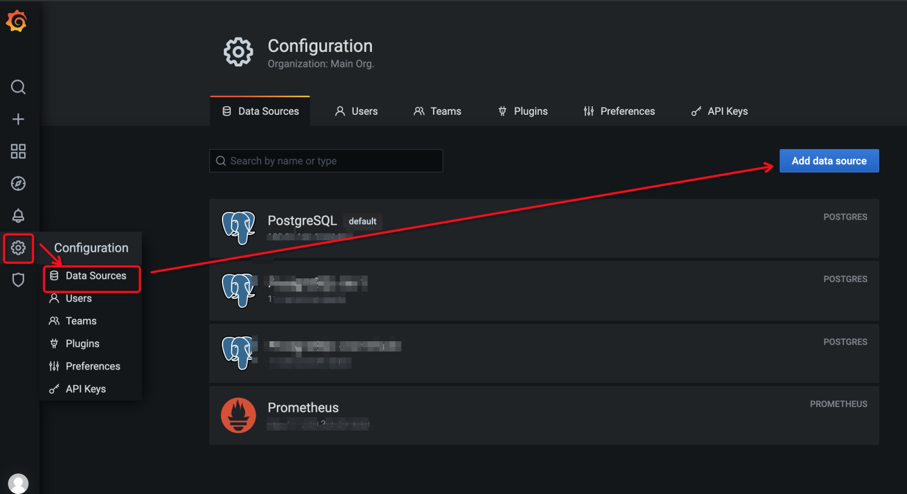
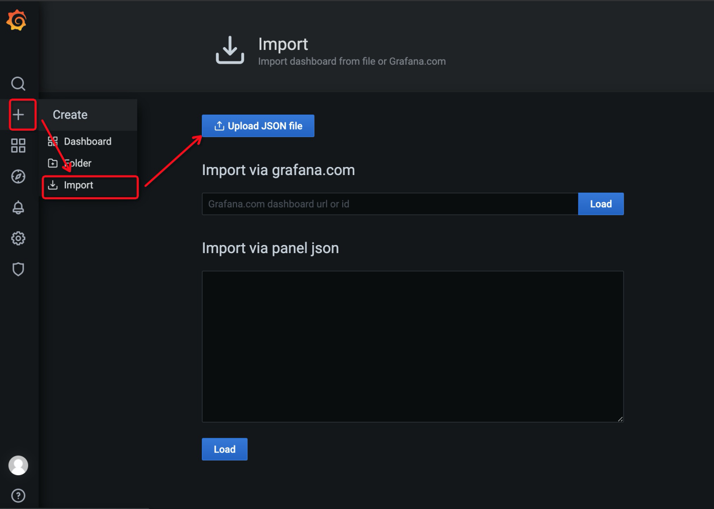

# 快速入门

本文档介绍了如何安装和运行PolarDB-NodeAgent，并查看采集到的监控数据。

对于PolarDB-for-PostgreSQL, PolarDB-NodeAgent默认在9974端口提供exporter服务, 供Prometheus收集数据, 具体配置可见[配置文档](configuration.md)。
此外, 还提供grafana dashboard配置方便展示。

## 安装

目前提供两种安装部署的方式：源码编译安装及RPM包安装，两种方式均需安装相关依赖。

### 安装依赖
  [安装golang](https://golang.org/doc/install)

### 源码编译 & 安装
1. 源码下载

   ```
   git clone git@github.com:ApsaraDB/PolarDB-NodeAgent.git
   ```

2. 编译

   ```
   go mod tidy
   go mod vendor
   make clean && make all
   ```

   或

   ```
   sh build.sh
   ```

3. 安装, 默认安装路径为`/opt/db-monitor`

   ```
   make install
   ```


### RPM包构建 & 安装

1. 源码下载

   ```
   git clone git@github.com:ApsaraDB/PolarDB-NodeAgent.git
   ```

2. 在源码目录下进入到 `rpm` 子目录，构建RPM包, 完成后RPM包在`$HOME/rpmbuild/RPMS/`路径下。

   ```
   rpmbuild -bb polardb-monitor.spec
   ```

3. 执行`yum install`或者`rpm -ivh`对RPM包进行安装。


## 运行

进入`/opt/db-monitor/`目录，执行如下命令进行启动、停止和重启操作：
```
# 启动
sh bin/service.sh start
# 停止
sh bin/service.sh stop
# 重启
sh bin/service.sh restart
```

## 查看监控数据

### Prometheus配置

在prometheus配置文件的`scrape_conigs`中, 添加以下配置:
```
  - job_name: 'polardb_o'

    # metrics_path defaults to '/metrics'
    # scheme defaults to 'http'.

    static_configs:
    - targets: ['0.0.0.0:9974']

    honor_labels: true

    scrape_interval: 20s
    scrape_timeout: 20s
```

具体监控指标可见[metrics说明](metrics.md)文档, 需要注意的是导入到prometheus中的指标全部添加了`polar_`前缀.

### Grafana

除数据库视图之外，目前还提供更直观的grafana展示，可以通过导入grafana dashboard配置的形式进行查看。
推荐使用最新版本的grafana 8.2.1，安装部署可见官方文档。

#### 添加数据源

Prometheus数据源配置请根据实际情况填写。



#### 导入Dashboard

PolarDB提供配置好的报表样例，在代码库`grafana`目录下。


