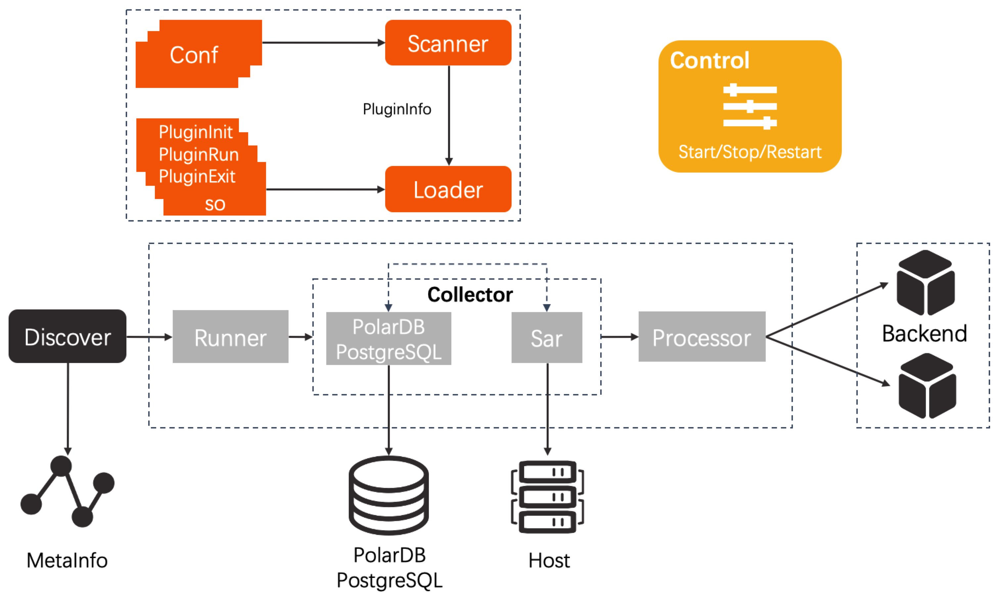

## Architecture Design

***db-monitor*** is a light-weight and flexible agent for data collection, which supports performance data collection from hosts and instances. It is a plug-in process running on physical machines or virtual machines, collecting performance data every second and real-time logs of all the instances (both containerized instances and non-containerized instances) on the machine. 

db-monitor has been tested in real projects on Alibaba Cloud.

### Goals of Design
 * Flexible, quick and easy to access
 * Light-weight with low resource occupation
 * Strong robustness
### How to Achieve Goals
 * Adopts mechanism of plug-in and supports writing codes of plug-in by Plugin and Lua. If you want to apply db-monitor to your application, you only need to write three functions.
 * Provides mechanism of plug-in orchestration and reusage. The code can be used by multiple applications after simple configuration, so that db-monitor can be applied in different applications.
 * Strong robustness. The performance data of each application on each instance will be collected by independent goroutine. This realizes isolation and retry on failure of collection threads.

### Architecture
 
