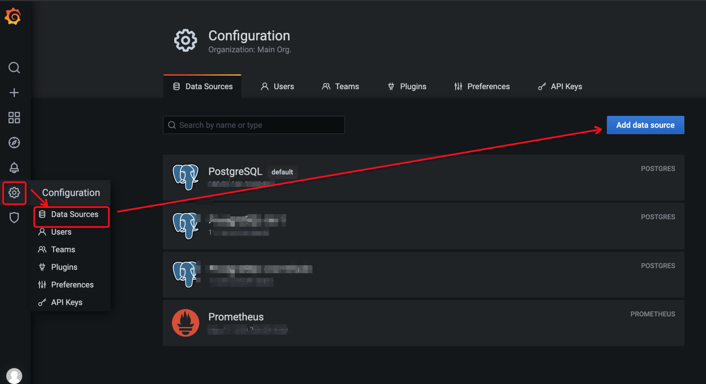

# Quick Start

This document describes how to install and run PolarDB-NodeAgent and view the collected performance data.

For PolarDB for PostgreSQL, PolarDB-NodeAgent writes the monitoring data back to the database by default, and provides views in the database for query. You can also push the monitoring data to prometheus pushgateway after configuration. For details about configuration, refer to [Configuration Document](configuration.md).

In addition, for the scenario where the monitoring data is stored in the database, PolarDB-NodeAgent also provides you a grafana dashboard for easy display.

For PolarDB for PostgreSQL, db-monitor writes the monitoring data back to the database by default, and provides views in the database for query. You can also push the monitoring data to prometheus pushgateway after configuration. For details about configuration, refer to [Configuration Document](configuration.md).

In addition, for the scenario where the monitoring data is stored in the database, db-monitor also provides you a grafana dashboard for easy display.

For PolarDB for PostgreSQL, db-monitor writes the monitoring data back to the database by default, and provides views in the database for query. You can also push the monitoring data to prometheus pushgateway after configuration. For details about configuration, refer to [Configuration Document](configuration.md).

In addition, for the scenario where the monitoring data is stored in the database, db-monitor also provides you a grafana dashboard for easy display.

## Installation

There are two ways to install PolarDB-NodeAgent: Installing by compiling source code and by by building RPM package.

### Install Dependence
Install Go. For details about how to install golang, refer to https://golang.org/doc/install.

### Compile Source Code and Install
1. Download the source code of PolarDB-NodeAgent.

   ```
   git clone git@github.com:ApsaraDB/PolarDB-NodeAgent.git

2. Compile.

   ```
   go mod tidy
   go mod vendor
   make clean && make all
   ```

   Or

   ```
   sh build.sh
   ```

3. Install, and it will be installed in `/opt/db-monitor` by default.

   ```
   make install
   ```


### Build RPM Package and Install

1. Download the source code of PolarDB-NodeAgent.

   ```
   git clone git@github.com:ApsaraDB/PolarDB-NodeAgent.git
   ```

2. Enter the `rpm` directory and build RPM package, and the RPM package is in `$HOME/rpmbuild/RPMS/`.

   ```
   rpmbuild -bb polardb-monitor.spec
   ```

3. Run `yum install` or `rpm -ivh` to install the RPM package.


### Start/Stop/Restart

Enter the directory `/opt/db-monitor/`, and run the following commands to start/stop/restart PolarDB-NodeAgent.

```
# Start
sh bin/service.sh start
# Stop
sh bin/service.sh stop
# Restart
sh bin/service.sh restart
```


## View Performance Data

### Database

All the collected data about the database performance are saved in the schema `polar_gawr_collection`. You can view the related views to check the data.

For example, view  `view_fact_dbmetrics` to check the resource usage about the database and related metrics.

For all the metrics and data description, refer to [Metrics Introduction](metrics.md).


### Grafana

In addition to the database view, you can also get a more intuitive view with grafana by importing the configuration of grafana dashboard. It is recommended to use the latest version of grafana 8.2.1. See the official documentation for installation and deployment.


#### Before You Start

* Authentication: Set the access configuration of the database in `pg_hba.conf`, if external access needed.
* Authorization: For non-super users, you need to grant `polar_gawr_user` role to your user account:

```
GRANT polar_gawr_user TO [your username];
```


#### Add Data Source

PolarDB uses `PostgreSQL` as data source, fill in the data source configuration according to the actual situation.



#### Import Dashboard

PolarDB provides configured report samples in the 'grafana' directory.


